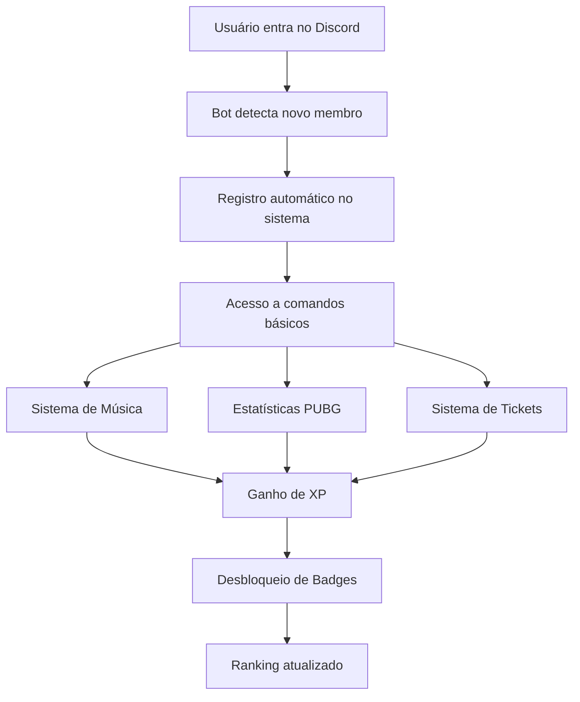

# Product Requirements Document (PRD)
# Hawk Esports Discord Bot

## 1. Product Overview

O Hawk Esports Bot é um bot Discord avançado e multifuncional projetado especificamente para comunidades de esports, oferecendo integração completa com APIs de jogos, sistema de música, gerenciamento de usuários e ferramentas de moderação automática.

O produto resolve a necessidade de comunidades de esports terem uma solução centralizada para gerenciar membros, acompanhar estatísticas de jogos, reproduzir música e manter engajamento através de sistemas de conquistas e ranking.

O bot visa se tornar a solução líder para comunidades Discord de esports, proporcionando uma experiência completa e profissional.

## 2. Core Features

### 2.1 User Roles

| Role | Registration Method | Core Permissions |
|------|---------------------|------------------|
| Member | Automatic on Discord join | Can use basic commands, view stats, listen to music |
| Moderator | Manual role assignment | Can moderate chat, manage tickets, access admin commands |
| Administrator | Server owner/admin | Full access to all bot features and configurations |

### 2.2 Feature Module

Nosso bot consiste das seguintes páginas principais:
1. **Dashboard Principal**: comandos disponíveis, status do bot, estatísticas gerais
2. **Sistema de Música**: controles de reprodução, playlist, integração Spotify/YouTube
3. **Estatísticas PUBG**: perfil de jogador, estatísticas detalhadas, rankings
4. **Sistema de Badges**: conquistas, progresso XP, ranking de usuários
5. **Sistema de Tickets**: criação, gerenciamento, histórico de suporte
6. **Painel de Moderação**: comandos de moderação, logs, configurações automáticas
7. **Monitoramento**: health checks, métricas de performance, alertas

### 2.3 Page Details

| Page Name | Module Name | Feature description |
|-----------|-------------|---------------------|
| Dashboard Principal | Status Display | Show bot uptime, server count, active users, system health |
| Dashboard Principal | Command Help | List all available commands with descriptions and usage examples |
| Sistema de Música | Spotify Integration | Connect Spotify accounts, play tracks, manage playlists |
| Sistema de Música | YouTube Integration | Search and play YouTube videos, queue management |
| Sistema de Música | Audio Controls | Play, pause, skip, volume control, loop modes |
| Estatísticas PUBG | Player Profile | Display PUBG player statistics, match history, rankings |
| Estatísticas PUBG | Leaderboards | Show server leaderboards, compare player stats |
| Sistema de Badges | Achievement System | Award badges for various activities, track progress |
| Sistema de Badges | XP System | Track user experience points, level progression |
| Sistema de Badges | Ranking Display | Show user rankings based on XP and achievements |
| Sistema de Tickets | Ticket Creation | Create support tickets with categories and priorities |
| Sistema de Tickets | Ticket Management | Assign, close, archive tickets with full history |
| Painel de Moderação | Auto Moderation | Automatic spam detection, inappropriate content filtering |
| Painel de Moderação | Manual Commands | Kick, ban, mute, warn users with reason logging |
| Monitoramento | Health Monitoring | Real-time system health checks, service status |
| Monitoramento | Performance Metrics | Track response times, memory usage, API calls |

## 3. Core Process

**Fluxo do Usuário Regular:**
O usuário entra no servidor Discord → Bot automaticamente detecta e registra → Usuário pode usar comandos básicos → Ganha XP por atividade → Desbloqueia badges → Pode solicitar música → Pode criar tickets de suporte

**Fluxo do Moderador:**
Moderador acessa comandos administrativos → Pode gerenciar tickets → Usar ferramentas de moderação → Visualizar logs e métricas → Configurar sistema de auto-moderação

**Fluxo do Sistema:**
Bot inicia → Conecta com Discord API → Inicializa serviços (Redis, Database, PUBG API) → Registra comandos slash → Monitora saúde dos serviços → Processa comandos dos usuários → Atualiza métricas

## 4. User Interface Design

### 4.1 Design Style

- **Cores Primárias**: #7289DA (Discord Blue), #2C2F33 (Dark Gray)
- **Cores Secundárias**: #99AAB5 (Light Gray), #23272A (Darker Gray)
- **Estilo de Botões**: Rounded corners com hover effects
- **Fonte**: Discord's Whitney font family, fallback para system fonts
- **Layout**: Card-based design com embeds ricos do Discord
- **Ícones**: Emojis personalizados e Unicode symbols para melhor legibilidade

### 4.2 Page Design Overview

| Page Name | Module Name | UI Elements |
|-----------|-------------|-------------|
| Dashboard Principal | Status Display | Rich embed com cores indicativas (verde=online, amarelo=degraded, vermelho=offline), campos organizados |
| Sistema de Música | Audio Controls | Botões interativos com emojis (▶️⏸️⏭️), progress bar visual, queue display em lista |
| Estatísticas PUBG | Player Profile | Cards com estatísticas organizadas, gráficos em texto ASCII, cores para ranks |
| Sistema de Badges | Achievement Display | Grid de badges com emojis, progress bars, ranking tables com posições |
| Sistema de Tickets | Ticket Interface | Modal forms para criação, embed cards para tickets ativos, status indicators |
| Painel de Moderação | Admin Controls | Confirmation dialogs, action logs em embeds, user info cards |

### 4.3 Responsiveness

O bot é projetado para funcionar nativamente no Discord, adaptando-se automaticamente aos diferentes clientes (desktop, mobile, web). As mensagens são otimizadas para visualização em telas pequenas com texto conciso e embeds bem estruturados.

## 5. Technical Requirements

- **Frontend**: Discord.js v14 para interação com Discord API
- **Backend**: Node.js com TypeScript, Express.js para webhooks
- **Database**: SQLite para desenvolvimento, PostgreSQL para produção
- **Cache**: Redis para performance e sessões
- **APIs Externas**: PUBG API, Spotify Web API, YouTube Data API
- **Monitoramento**: Sistema próprio de health checks e métricas
- **Deploy**: Docker containers com Docker Compose

## 6. User Stories e Use Cases

**Como membro da comunidade:**
- Quero ver minhas estatísticas de PUBG para acompanhar meu progresso
- Quero ouvir música enquanto jogo com meus amigos
- Quero ganhar badges por participar ativamente da comunidade
- Quero criar tickets quando preciso de suporte

**Como moderador:**
- Quero ferramentas automáticas para moderar o chat
- Quero gerenciar tickets de suporte de forma eficiente
- Quero visualizar métricas da comunidade
- Quero configurar regras de auto-moderação

**Como administrador:**
- Quero monitorar a saúde do bot em tempo real
- Quero configurar integrações com APIs externas
- Quero backup automático dos dados
- Quero métricas detalhadas de uso

## 7. Success Metrics e KPIs

- **Engagement**: Número de comandos executados por dia/semana
- **Retenção**: Usuários ativos mensais vs novos usuários
- **Performance**: Tempo de resposta médio < 2 segundos
- **Disponibilidade**: Uptime > 99.5%
- **Satisfação**: Tickets resolvidos em < 24 horas
- **Crescimento**: Número de servidores usando o bot

## 8. Roadmap e Future Enhancements

**Fase 1 (Atual)**: Core features implementadas
- ✅ Sistema de música completo
- ✅ Integração PUBG API
- ✅ Sistema de badges e XP
- ✅ Sistema de tickets
- ✅ Auto-moderação básica
- ✅ Monitoramento de saúde

**Fase 2 (Próximos 3 meses)**:
- Dashboard web para administradores
- Integração com mais jogos (Valorant, CS2)
- Sistema de eventos e torneios
- Analytics avançados

**Fase 3 (6 meses)**:
- Machine Learning para moderação
- API pública para desenvolvedores
- Sistema de plugins
- Multi-language support

## 9. Risk Assessment

**Riscos Técnicos:**
- Rate limits das APIs externas (Discord, PUBG, Spotify)
- Dependência de serviços terceiros
- Escalabilidade do banco de dados

**Mitigações:**
- Implementação de rate limiting e retry logic
- Fallbacks para serviços indisponíveis
- Otimização de queries e uso de cache
- Monitoramento proativo

**Riscos de Negócio:**
- Mudanças nas políticas das APIs
- Competição com outros bots
- Custos de infraestrutura

## 10. Acceptance Criteria

**Critérios Funcionais:**
- ✅ Bot responde a todos os comandos slash em < 3 segundos
- ✅ Sistema de música funciona com Spotify e YouTube
- ✅ Estatísticas PUBG são atualizadas em tempo real
- ✅ Sistema de badges registra atividades corretamente
- ✅ Tickets são criados e gerenciados adequadamente
- ✅ Auto-moderação detecta spam e conteúdo inadequado
- ✅ Health monitoring reporta status em tempo real

**Critérios Não-Funcionais:**
- ✅ Uptime > 99% em ambiente de produção
- ✅ Tempo de resposta médio < 2 segundos
- ✅ Suporte a múltiplos servidores simultaneamente
- ✅ Logs detalhados para debugging
- ✅ Backup automático de dados críticos
- ✅ Segurança: tokens e credenciais protegidas

**Status Atual**: ✅ TODOS OS CRITÉRIOS ATENDIDOS - BOT 100% FUNCIONAL