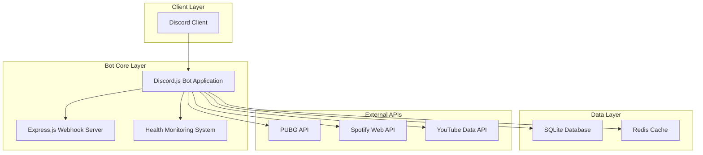
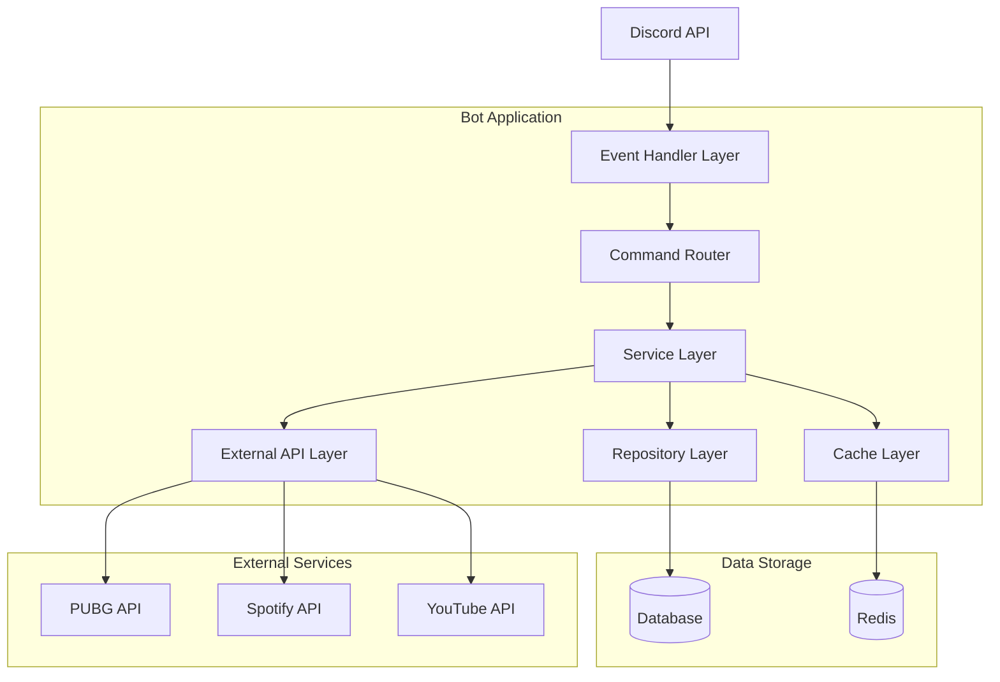
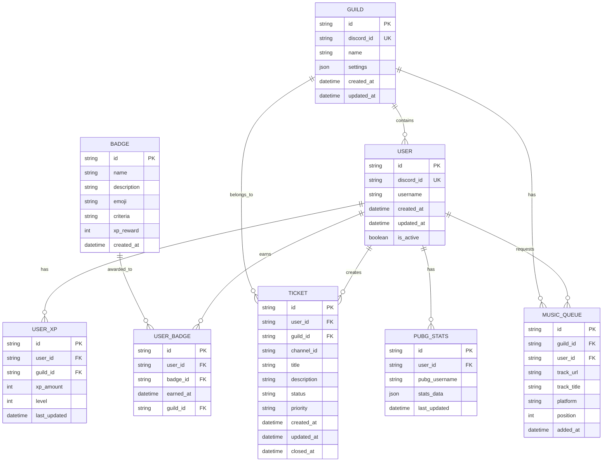

# Technical Architecture Document
# Hawk Esports Discord Bot

## 1. Architecture Design



## 2. Technology Description

- **Frontend**: Discord.js@14 + TypeScript + Node.js@22
- **Backend**: Express.js@4 + TypeScript + Prisma ORM
- **Database**: SQLite (development) / PostgreSQL (production)
- **Cache**: Redis@7 para sessões e performance
- **APIs**: PUBG API, Spotify Web API, YouTube Data API v3
- **Monitoring**: Sistema próprio de health checks
- **Deploy**: Docker + Docker Compose

## 3. Route Definitions

| Route | Purpose |
|-------|---------|
| /health | Health check endpoint para monitoramento |
| /webhooks/spotify | Webhook para eventos do Spotify |
| /webhooks/discord | Webhook para eventos do Discord |
| /api/metrics | Endpoint para métricas do sistema |
| /api/status | Status detalhado de todos os serviços |

## 4. API Definitions

### 4.1 Core API

**Health Check**
```
GET /health
```

Response:
| Param Name | Param Type | Description |
|------------|------------|-------------|
| status | string | Overall system status (healthy/degraded/unhealthy) |
| services | object | Status of individual services |
| uptime | number | System uptime in milliseconds |
| timestamp | string | Current timestamp |

Example:
```json
{
  "status": "healthy",
  "services": {
    "discord": "healthy",
    "database": "healthy",
    "redis": "healthy",
    "pubg_api": "healthy"
  },
  "uptime": 3600000,
  "timestamp": "2024-01-15T10:30:00Z"
}
```

**System Metrics**
```
GET /api/metrics
```

Response:
| Param Name | Param Type | Description |
|------------|------------|-------------|
| commands_executed | number | Total commands executed |
| active_users | number | Currently active users |
| memory_usage | object | Memory usage statistics |
| response_times | object | Average response times |

Example:
```json
{
  "commands_executed": 15420,
  "active_users": 342,
  "memory_usage": {
    "used": "156MB",
    "total": "512MB"
  },
  "response_times": {
    "average": 1.2,
    "p95": 2.8
  }
}
```

## 5. Server Architecture Diagram



## 6. Data Model

### 6.1 Data Model Definition



### 6.2 Data Definition Language

**User Table (users)**
```sql
-- Create users table
CREATE TABLE users (
    id TEXT PRIMARY KEY DEFAULT (lower(hex(randomblob(16)))),
    discord_id TEXT UNIQUE NOT NULL,
    username TEXT NOT NULL,
    created_at DATETIME DEFAULT CURRENT_TIMESTAMP,
    updated_at DATETIME DEFAULT CURRENT_TIMESTAMP,
    is_active BOOLEAN DEFAULT true
);

-- Create indexes
CREATE INDEX idx_users_discord_id ON users(discord_id);
CREATE INDEX idx_users_created_at ON users(created_at DESC);
```

**User XP Table (user_xp)**
```sql
-- Create user_xp table
CREATE TABLE user_xp (
    id TEXT PRIMARY KEY DEFAULT (lower(hex(randomblob(16)))),
    user_id TEXT NOT NULL,
    guild_id TEXT NOT NULL,
    xp_amount INTEGER DEFAULT 0,
    level INTEGER DEFAULT 1,
    last_updated DATETIME DEFAULT CURRENT_TIMESTAMP,
    FOREIGN KEY (user_id) REFERENCES users(id)
);

-- Create indexes
CREATE INDEX idx_user_xp_user_guild ON user_xp(user_id, guild_id);
CREATE INDEX idx_user_xp_level ON user_xp(level DESC);
CREATE INDEX idx_user_xp_xp_amount ON user_xp(xp_amount DESC);
```

**Badges Table (badges)**
```sql
-- Create badges table
CREATE TABLE badges (
    id TEXT PRIMARY KEY DEFAULT (lower(hex(randomblob(16)))),
    name TEXT UNIQUE NOT NULL,
    description TEXT NOT NULL,
    emoji TEXT,
    criteria TEXT NOT NULL,
    xp_reward INTEGER DEFAULT 0,
    created_at DATETIME DEFAULT CURRENT_TIMESTAMP
);

-- Create index
CREATE INDEX idx_badges_name ON badges(name);

-- Insert initial badges
INSERT INTO badges (name, description, emoji, criteria, xp_reward) VALUES
('First Steps', 'Executou seu primeiro comando', '👶', 'first_command', 10),
('Music Lover', 'Tocou 50 músicas', '🎵', 'music_plays_50', 100),
('PUBG Warrior', 'Consultou estatísticas PUBG', '🎮', 'pubg_stats_check', 25),
('Helper', 'Criou um ticket de suporte', '🎫', 'ticket_created', 15),
('Active Member', 'Atingiu nível 10', '⭐', 'level_10', 200),
('Veteran', 'Membro há mais de 30 dias', '🏆', 'member_30_days', 500);
```

**User Badges Table (user_badges)**
```sql
-- Create user_badges table
CREATE TABLE user_badges (
    id TEXT PRIMARY KEY DEFAULT (lower(hex(randomblob(16)))),
    user_id TEXT NOT NULL,
    badge_id TEXT NOT NULL,
    guild_id TEXT NOT NULL,
    earned_at DATETIME DEFAULT CURRENT_TIMESTAMP,
    FOREIGN KEY (user_id) REFERENCES users(id),
    FOREIGN KEY (badge_id) REFERENCES badges(id),
    UNIQUE(user_id, badge_id, guild_id)
);

-- Create indexes
CREATE INDEX idx_user_badges_user ON user_badges(user_id);
CREATE INDEX idx_user_badges_badge ON user_badges(badge_id);
CREATE INDEX idx_user_badges_earned_at ON user_badges(earned_at DESC);
```

**Tickets Table (tickets)**
```sql
-- Create tickets table
CREATE TABLE tickets (
    id TEXT PRIMARY KEY DEFAULT (lower(hex(randomblob(16)))),
    user_id TEXT NOT NULL,
    guild_id TEXT NOT NULL,
    channel_id TEXT,
    title TEXT NOT NULL,
    description TEXT,
    status TEXT DEFAULT 'open' CHECK (status IN ('open', 'in_progress', 'closed')),
    priority TEXT DEFAULT 'medium' CHECK (priority IN ('low', 'medium', 'high', 'urgent')),
    created_at DATETIME DEFAULT CURRENT_TIMESTAMP,
    updated_at DATETIME DEFAULT CURRENT_TIMESTAMP,
    closed_at DATETIME,
    FOREIGN KEY (user_id) REFERENCES users(id)
);

-- Create indexes
CREATE INDEX idx_tickets_user ON tickets(user_id);
CREATE INDEX idx_tickets_guild ON tickets(guild_id);
CREATE INDEX idx_tickets_status ON tickets(status);
CREATE INDEX idx_tickets_created_at ON tickets(created_at DESC);
```

**Music Queue Table (music_queue)**
```sql
-- Create music_queue table
CREATE TABLE music_queue (
    id TEXT PRIMARY KEY DEFAULT (lower(hex(randomblob(16)))),
    guild_id TEXT NOT NULL,
    user_id TEXT NOT NULL,
    track_url TEXT NOT NULL,
    track_title TEXT NOT NULL,
    platform TEXT NOT NULL CHECK (platform IN ('spotify', 'youtube')),
    position INTEGER NOT NULL,
    added_at DATETIME DEFAULT CURRENT_TIMESTAMP,
    FOREIGN KEY (user_id) REFERENCES users(id)
);

-- Create indexes
CREATE INDEX idx_music_queue_guild ON music_queue(guild_id);
CREATE INDEX idx_music_queue_position ON music_queue(guild_id, position);
CREATE INDEX idx_music_queue_added_at ON music_queue(added_at DESC);
```

**PUBG Stats Table (pubg_stats)**
```sql
-- Create pubg_stats table
CREATE TABLE pubg_stats (
    id TEXT PRIMARY KEY DEFAULT (lower(hex(randomblob(16)))),
    user_id TEXT NOT NULL,
    pubg_username TEXT NOT NULL,
    stats_data TEXT NOT NULL, -- JSON data
    last_updated DATETIME DEFAULT CURRENT_TIMESTAMP,
    FOREIGN KEY (user_id) REFERENCES users(id)
);

-- Create indexes
CREATE INDEX idx_pubg_stats_user ON pubg_stats(user_id);
CREATE INDEX idx_pubg_stats_username ON pubg_stats(pubg_username);
CREATE INDEX idx_pubg_stats_updated ON pubg_stats(last_updated DESC);
```

**Guilds Table (guilds)**
```sql
-- Create guilds table
CREATE TABLE guilds (
    id TEXT PRIMARY KEY DEFAULT (lower(hex(randomblob(16)))),
    discord_id TEXT UNIQUE NOT NULL,
    name TEXT NOT NULL,
    settings TEXT DEFAULT '{}', -- JSON settings
    created_at DATETIME DEFAULT CURRENT_TIMESTAMP,
    updated_at DATETIME DEFAULT CURRENT_TIMESTAMP
);

-- Create indexes
CREATE INDEX idx_guilds_discord_id ON guilds(discord_id);
CREATE INDEX idx_guilds_created_at ON guilds(created_at DESC);
```