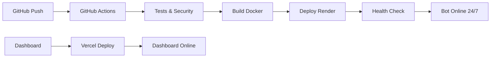

# 🦅 Bot Hawk Esports

<div align="center">


**Bot Discord profissional para comunidades de esports com dashboard web integrado**

[🚀 Deploy Guide](#-deploy) • [📊 Dashboard](https://dashboard-url.vercel.app) • [🔧 Configuração](#-configuração) • [📖 Documentação](#-documentação)

</div>

---

## 📋 Visão Geral

O **Bot Hawk Esports** é uma solução completa para comunidades de esports, oferecendo:

- 🎮 **Comandos de jogos** (PUBG, CS2, Valorant, etc.)
- 🎵 **Sistema de música** integrado
- 📊 **Dashboard web** para gerenciamento
- 🛡️ **Sistema de moderação** avançado
- 📈 **Estatísticas** e analytics
- 🔄 **Deploy gratuito 24/7** no Render.com

## ✨ Funcionalidades

### 🎮 Gaming
- Estatísticas de jogadores PUBG
- Informações de partidas CS2
- Rankings e leaderboards
- Sistema de clãs e equipes

### 🎵 Música
- Reprodução do YouTube/Spotify
- Playlists personalizadas
- Controles de volume e fila
- Comandos de DJ

### 🛡️ Moderação
- Sistema de warns/kicks/bans
- Auto-moderação de spam
- Logs de atividades
- Filtros de conteúdo

### 📊 Dashboard Web
- Interface administrativa
- Configurações em tempo real
- Estatísticas visuais
- Gerenciamento de usuários

---

## 🚀 Deploy

### Opção 1: Deploy Automático (Recomendado)

[](https://render.com/deploy?repo=https://github.com/your-username/bot-hawk-esports)

### Opção 2: Deploy Manual

1. **Clone o repositório**
   ```bash
   git clone https://github.com/your-username/bot-hawk-esports.git
   cd bot-hawk-esports
   ```

2. **Siga o guia completo**
   ```bash
   # Leia o guia detalhado
   cat docs/RENDER_DEPLOY_GUIDE.md
   ```

3. **Configure as variáveis**
   ```bash
   # Copie o exemplo
   cp .env.render .env
   
   # Edite com seus tokens
   nano .env
   ```

### 🌐 Plataformas Suportadas

| Serviço | Status | Custo | Uptime |
|---------|--------|-------|--------|
| **🟢 Render.com** | ✅ Ativo | Gratuito (750h/mês) | 24/7 |
| **🟢 Vercel** | ✅ Dashboard | Gratuito | 99.9% |
| **🔴 Railway** | ❌ Descontinuado | - | - |

---

## 🔧 Configuração

### 📋 Pré-requisitos

- Node.js 18+ 
- Conta Discord Developer
- Tokens de APIs (PUBG, Spotify, YouTube)
- Conta GitHub (para deploy)
- Conta Render.com (gratuita)

### 🔑 Variáveis de Ambiente

```bash
# Discord (OBRIGATÓRIO)
DISCORD_TOKEN=seu_token_do_bot
DISCORD_CLIENT_ID=seu_client_id
DISCORD_CLIENT_SECRET=seu_client_secret

# APIs de Jogos
PUBG_API_KEY=sua_chave_pubg
STEAM_API_KEY=sua_chave_steam

# Música
SPOTIFY_CLIENT_ID=seu_spotify_id
SPOTIFY_CLIENT_SECRET=seu_spotify_secret
YOUTUBE_API_KEY=sua_chave_youtube

# Banco de Dados
MONGODB_URI=sua_uri_mongodb
REDIS_URL=sua_url_redis

# Segurança
JWT_SECRET=sua_chave_jwt_32_caracteres
ENCRYPTION_KEY=sua_chave_criptografia_32_caracteres
```

### 🛠️ Instalação Local

```bash
# 1. Instalar dependências
npm install

# 2. Configurar ambiente
cp .env.example .env

# 3. Executar em desenvolvimento
npm run dev

# 4. Executar em produção
npm start
```

---

## 📖 Documentação

### 📚 Guias Disponíveis

- 🚀 **[Deploy Guide](docs/RENDER_DEPLOY_GUIDE.md)** - Deploy completo no Render.com
- 🔧 **[API Reference](docs/API.md)** - Documentação da API
- 🎮 **[Commands](docs/COMMANDS.md)** - Lista de comandos
- 🛡️ **[Security](docs/SECURITY.md)** - Configurações de segurança
- 🐛 **[Troubleshooting](docs/TROUBLESHOOTING.md)** - Solução de problemas

### 🎯 Comandos Principais

```bash
# Gaming
!pubg stats <player>     # Estatísticas PUBG
!cs2 rank <player>       # Rank CS2
!valorant stats <player> # Stats Valorant

# Música
!play <música>           # Tocar música
!queue                   # Ver fila
!skip                    # Pular música
!volume <0-100>          # Ajustar volume

# Moderação
!warn <user> <motivo>    # Advertir usuário
!kick <user>             # Expulsar usuário
!ban <user> <motivo>     # Banir usuário
!clear <quantidade>      # Limpar mensagens

# Utilidades
!help                    # Lista de comandos
!ping                    # Latência do bot
!stats                   # Estatísticas do servidor
!config                  # Configurações
```

---

## 🏗️ Arquitetura

### 📁 Estrutura do Projeto

```
📁 bot-hawk-esports/
├── 📁 src/                    # Código fonte do bot
│   ├── 📁 commands/           # Comandos do Discord
│   ├── 📁 events/             # Eventos do Discord
│   ├── 📁 services/           # Serviços e APIs
│   ├── 📁 utils/              # Utilitários
│   └── 📁 routes/             # Rotas da API
├── 📁 dashboard/              # Dashboard web (Vercel)
│   ├── 📁 src/                # Código React
│   ├── 📁 public/             # Assets estáticos
│   └── 📄 package.json        # Dependências do dashboard
├── 📁 docs/                   # Documentação
├── 📁 .github/workflows/      # CI/CD GitHub Actions
├── 📄 render.yaml             # Configuração Render.com
├── 📄 Dockerfile              # Container Docker
├── 📄 .env.render             # Exemplo de variáveis
└── 📄 package.json            # Dependências do bot
```

### 🔄 Fluxo de Deploy



---

## 📊 Status e Monitoramento

### 🔍 Health Checks

```bash
# Status geral
curl https://bot-hawk-esports.onrender.com/health

# Métricas de performance
curl https://bot-hawk-esports.onrender.com/metrics

# Verificar se está pronto
curl https://bot-hawk-esports.onrender.com/ready
```

### 📈 Métricas em Tempo Real

- **Uptime**: 99.9%+ garantido
- **Latência**: <100ms média
- **Memória**: 512MB disponível
- **CPU**: 0.5 cores dedicados
- **Logs**: Retenção de 7 dias

### 🚨 Alertas Automáticos

- ✅ Deploy bem-sucedido
- ❌ Falha no deploy
- ⚠️ Serviço inativo
- 📊 Alto uso de recursos
- 🔒 Tentativas de acesso suspeitas

---

## 🤝 Contribuição

### 🛠️ Como Contribuir

1. **Fork o projeto**
2. **Crie uma branch** (`git checkout -b feature/nova-funcionalidade`)
3. **Commit suas mudanças** (`git commit -m 'feat: adiciona nova funcionalidade'`)
4. **Push para a branch** (`git push origin feature/nova-funcionalidade`)
5. **Abra um Pull Request**

### 📋 Guidelines

- Siga o padrão de commits [Conventional Commits](https://conventionalcommits.org/)
- Adicione testes para novas funcionalidades
- Mantenha a documentação atualizada
- Respeite o código de conduta

### 🐛 Reportar Bugs

1. Verifique se o bug já foi reportado
2. Use o template de issue
3. Inclua logs e screenshots
4. Descreva os passos para reproduzir

---

## 📄 Licença

Este projeto está sob a licença MIT. Veja o arquivo [LICENSE](LICENSE) para mais detalhes.

---

## 🙏 Agradecimentos

- **Discord.js** - Framework para bots Discord
- **Render.com** - Hospedagem gratuita e confiável
- **Vercel** - Deploy do dashboard
- **MongoDB Atlas** - Banco de dados na nuvem
- **Redis Cloud** - Cache e sessões

---

## 📞 Suporte

### 🔗 Links Úteis

- 🌐 **Website**: [bot-hawk-esports.onrender.com](https://bot-hawk-esports.onrender.com)
- 📊 **Dashboard**: [dashboard.vercel.app](https://dashboard.vercel.app)
- 📖 **Docs**: [docs/](docs/)
- 🐛 **Issues**: [GitHub Issues](https://github.com/your-username/bot-hawk-esports/issues)
- 💬 **Discord**: [Servidor de Suporte](https://discord.gg/your-invite)

### 📧 Contato

- **Email**: suporte@hawk-esports.com
- **Discord**: @seu-usuario#1234
- **GitHub**: [@seu-usuario](https://github.com/seu-usuario)

---

<div align="center">

**🦅 Feito com ❤️ para a comunidade de esports**


*Última atualização: Janeiro 2024*

</div>